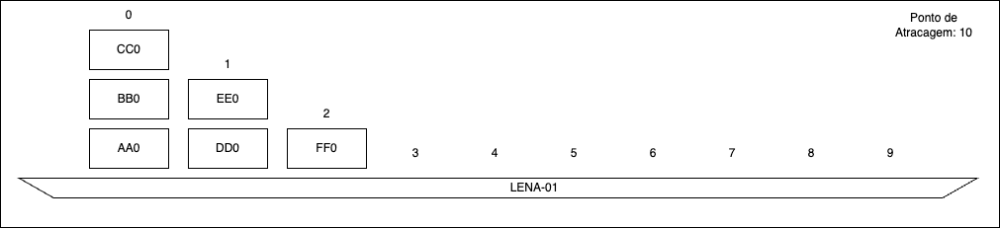

# Projecto Final 2023

# Descrição do problema

Neste exercício vamos desenvolver um simulador de um estaleiro de embarcações de carga. 
Neste estaleiro podem atracar até 50 embarcações. Os lugares para atracagem estão identificados de 0 a 49. 

Cada embarcação é inequivocamente identificada por uma matrícula composta por 4 letras e 2 números. 
Cada embarcação pode conter até 10 pilhas de contentores, identificadas pelos números de 0 a 9. 

E cada contentor é identificado por um código único composto por 2 letras e 1 número. Cada contentor tem também associado um peso, em kg.

Existem ainda 10 pilhas de contentores em terra identificadas pelos nomes T0, T1, ... T9.

Existem duas gruas identificadas pelas letras A e B, que servem para mover contentores entre pilhas. As gruas têm comportamentos ligeiramente diferentes, contudo ambas transportam contentores que estão numa determinada pilha de uma embarcação para outra pilha que poderá estar na mesma embarcação, noutra embarcação, ou em terra. 

Não há limite para o número de contentores que uma pilha pode suportar.

A título de exemplo suponha que a embarcação `LENA-01` está atracada no ponto de atracagem 10. Esta embarcação tem 3 pilhas de contentores. A pilha 0 tem os contentores AA0 BB0 CC0, a pilha 1 tem os contores DD0 EE0 e a pilha 2 tem os contentores FF0, como se pode ver na seguinte imagem:



Qualquer uma das gruas pode, por exemplo, mover 1 contentor da pilha 1 para a pilha 2 e neste caso será sempre retirado o contentor que está no topo da pilha, ou seja o EE0. As gruas podem também mover 2 contentores da pilha 0 para a pilha 1, e neste caso serão movidos os contentores CC0 e BB0. A diferença de funcionamento das duas gruas prende-se com a ordem pela qual os contentores são movidos. A grua A apenas consegue mover um contentor de cada vez, pegando sempre no contentor que está no topo. A grua B consegue mover até 4 contentores de uma só vez, preservando a ordem original desse grupo de contentores. Suponhamos que partimos da configuração original do exemplo:
```
  CC0
  BB0   EE0
  AA0   DD0    FF0
|-----|------|------|
   0     1      2
10: LENA-01
```

Se a grua A for ordenada a mover 2 contentores da pilha 0 para a pilha 2, no fim da operação, a pilha 2 terá os contentores BB0, CC0 e FF0:
```
               BB0
        EE0    CC0
  AA0   DD0    FF0
|-----|------|------|
   0     1      2
```
Por outro lado se o mesmo comando for dado à grua B, a pilha 2 ficaria com os contentores CC0, BB0, FF0:
```
               CC0
        EE0    BB0
  AA0   DD0    FF0
|-----|------|------|
   0     1      2 
```

## Execução do programa
O programa deverá aceitar um parâmetro na linha de comandos que indica o nome do ficheiro de configuração que deverá ser lido. Por exemplo
```
./porto ficheiro_porto_lisboa.txt
```
Caso o ficheiro não exista, o programa deve terminar após apresentar a mensagem 
```ERROR: could not open file```

Caso o ficheiro não respeite o formato esperado, o programa deve terminar após apresentar a mensagem 
```ERROR: file format is not recognized```


## Leitura do ficheiro de configuração

O simulador começa por ler de um ficheiro a configuração do porto. Este organiza-se da seguinte forma:
```
<ponto de atracagem> <matricula>
	P0 <contentor 0 pilha 0 peso> <contentor 1 pilha 0 peso> <contentor 2 pilha 2 peso>
	P1 <contentor 0 pilha 1peso> <contentor 1 pilha 1 peso> <contentor 2 pilha 1 peso>
...
```
O ficheiro contém apenas informação relativa a pontos de atracagem que estão ocupados por embarcações, assim como contém apenas informação sobre pilhas que têm contentores. Pontos de embarcação que não estejam no ficheiro estão, por defeito livres. Assim como, pilhas que não têm contentores são consideradas vazias. 
As pilhas que estão em terra estão, inicialmente, vazias.

Exemplo:
```
10 LENA-01
	P0 AA0 1000 BB0 2000 CC0 1500
	P1 DD0 800 EE0 600
	P2 FF0 750
```
Neste exemplo a embarcação LENA-01 encontra-se atracada no ponto 10 e contém as pilhas 0 1 e 2 ocupadas com contentores. As restantes pilhas desta embarcação estão vazias (livres) e poderão vir a ter contentores colocados por uma das gruas. Os restantes pontos de atracagem estão livres.

Tanto os pontos de atracagem, como as pilhas, não necessitam de estar por ordem. No entanto, os contentores estão representados por ordem. No ficheiro da esquerda para a direita, representa os contentores que estão na pilha de baixo para cima. Um outro ficheiro válido que produziria o mesmo resultado do exemplo anterior seria:
```
10 LENA-01
	P2 FF0 750
	P5
	P1 DD0 800 EE0 600
	P6
	P0 AA0 1000 BB0 2000 CC0 1500
```
Neste caso, as pilhas não aparecem por ordem. Além disso há duas pilhas, P5 e P6 que estão explicitamente vazias.


Apó leitura do ficheiro, o programa deverá aceitar comandos introduzidos pelo utilizador, de acordo com o seguinte menu:
```
move <grua> <ponto origem/embarcação> <ponto destino/embarcação> <numero de contentores>
show <ponto/embarcacao/all>
navigate <ponto/embarcacao> <ponto destino>
help
save <filename>
quit
```
Em seguida detalha-se o funcionamento de cada comando.

## Comando `move`
Este comando recebe a grua, o ponto de origem, o ponto de destino e o número de contentores


