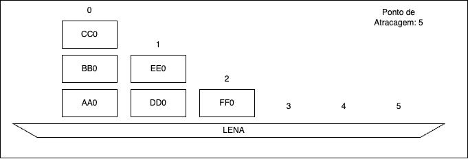

# Projecto Final 2023

**UNIVERSIDADE LUSÓFONA DE HUMANIDADES E TECNOLOGIAS**

*Linguagens de Programação I*

# Projecto Final 2023 - PORT MANAGER
>Na resolução deste projecto deve ser utilizada a Linguagem de Programação C. Para além da correta implementação dos requisitos, tenha em conta os seguintes aspetos:
>- O código apresentado deve ser bem indentado. 
>- O código deve compilar sem erros ou *warnings* utilizando o *gcc* com as seguintes flags:
>- `-g -Wvla -Wall -Wpedantic -Wextra -Wdeclaration-after-statement`
>- Tenha em atenção os nomes dados das variáveis, para que sejam indicadores daquilo que as mesmas vão conter.
>- O trabalho deve ser desenvolvido e submetido de forma individual.

>Este exercício deverá ser submetido na plataforma Pandora até às 23h59 de dia ?? Junho e será contabilizado para a nota final da unidade curricular de acordo com os critérios disponibilizados na página da disciplina, concretamente nos slides da primeira aula.

>Todos os trabalhos serão comparados utilizando um sistema de deteção de plágio.


# Descrição do problema

Neste exercício vamos desenvolver um simulador de um estaleiro de embarcações de carga. 
- Neste estaleiro podem atracar até 10 embarcações. Os lugares para atracagem estão identificados de 0 a 9. 
- Cada embarcação é inequivocamente identificada por uma matrícula composta por 4 letras maiúsculas (os caracteres permitidos são de A a Z, exemplo ALBA). 
- Cada embarcação pode conter até 6 pilhas de contentores, identificadas pelos números de 0 a 5. 
- Cada contentor é identificado por um código único composto por 2 letras e 1 número (exemplo BB7).

- Cada contentor tem também associado um peso, em kg.

- Existe um ponto de atracagem adicional (identificado pelo número 10), onde está atracada uma embarcação virtual com matrícula TERR. Este ponto serve para colocar contentores em terra e por essa razão, a embarcação não pode sair do lugar onde se encontra. 

- Existem duas gruas identificadas pelas letras A e B, que servem para mover contentores entre pilhas. As gruas têm comportamentos ligeiramente diferentes, contudo ambas transportam contentores que estão numa determinada pilha de uma embarcação para outra pilha que poderá estar na mesma embarcação, noutra embarcação, ou em terra. 

- Não há limite para o número de contentores que uma pilha pode suportar.

A título de exemplo suponha que a embarcação `LENA` está atracada no ponto de atracagem `5`. Esta embarcação tem 3 pilhas de contentores. A pilha 0 tem os contentores AA0 BB0 CC0, a pilha 1 tem os contentores DD0 EE0 e a pilha P2 tem os contentores FF0, como se pode ver na seguinte imagem:





Qualquer uma das gruas pode, por exemplo, mover 1 contentor da pilha 1 para a pilha 2 e neste caso será sempre retirado o contentor que está no topo da pilha, ou seja o EE0.  A grua B pode também mover 2 contentores da pilha 0 para a pilha 1, e neste caso serão movidos os contentores CC0 e BB0.

A diferença de funcionamento das duas gruas prende-se com a ordem pela qual os contentores são movidos. A grua A apenas consegue mover um contentor de cada vez, pegando sempre no contentor que está no topo. A grua B consegue mover até 4 contentores de uma só vez, preservando a ordem original desse grupo de contentores. Suponhamos que partimos da configuração original do exemplo:
```
  CC0
  BB0   EE0
  AA0   DD0    FF0
|-----|------|------|
   0      1     2
5: LENA
```

Se a grua A for ordenada a mover 2 contentores da pilha 0 para a pilha 2, ele teria de fazer dois movimentos onde no fim da operação, a pilha 2 terá os contentores BB0, CC0 e FF0:
```
               BB0
        EE0    CC0
  AA0   DD0    FF0
|-----|------|------|
   0      1      2
```
Por outro lado se o mesmo comando for dado à grua B, a pilha 2 ficaria com os contentores CC0, BB0, FF0:
```
               CC0
        EE0    BB0
  AA0   DD0    FF0
|-----|------|------|
   0     1       2 
```

A grua B move sempre o máximo de contentores possível de cada vez. Caso haja uma ordem para mover um número superior a 4, a grua terá de fazer mais do que um movimento.

## Execução do programa
O programa deverá aceitar um parâmetro na linha de comandos que indica o nome do ficheiro de configuração que deverá ser lido pelo simulador. Por exemplo:
```
./porto ficheiro_porto_lisboa.txt
```
Caso o ficheiro não exista, o simulador deve terminar após apresentar a mensagem 
```ERROR: could not open file```

Caso o ficheiro não respeite o formato esperado, o programa deve terminar após apresentar a mensagem 
```ERROR: file format is not recognized```

Após a leitura do ficheiro de configuração, o simulador deve apresentar um menu (ver secção Menu Principal) e começar a aceitar comandos do utilizador.

## Leitura do ficheiro de configuração

O simulador começa por ler de um ficheiro a configuração do porto. O ficheiro organiza-se da seguinte forma:
```
<ponto de atracagem> <matricula>
	0 <contentor 0 da pilha 0:peso> <contentor 1 pilha 0:peso> <contentor 2 pilha 2:peso>...
	1 <contentor 0 da pilha 1:peso> <contentor 1 pilha 1:peso> <contentor 2 pilha 1:peso>...
...
```
O ficheiro contém apenas informação relativa a pontos de atracagem que estão ocupados por embarcações, assim como contém apenas informação sobre as pilhas que têm contentores. Pontos de embarcação que não estejam no ficheiro estão, por defeito livres. Assim como, pilhas que não têm contentores são consideradas vazias. 

Exemplo:
```
5 LENA
	0 AA0:1000 BB0:2000 CC0:1500
	1 DD0:800 EE0:600
	2 FF0:750
```
Neste exemplo a embarcação LENA encontra-se atracada no ponto 5 e contém as pilhas 0 1 e 2 ocupadas com contentores. As restantes pilhas desta embarcação estão vazias (livres) e poderão vir a ter contentores colocados por uma das gruas. Os restantes pontos de atracagem estão livres.

Tanto os pontos de atracagem, como as pilhas, não necessitam de estar por ordem. No entanto, os contentores estão representados por ordem. No ficheiro da esquerda para a direita, representa os contentores que estão na pilha de baixo para cima. Um outro ficheiro válido que produziria o mesmo resultado do exemplo anterior seria:
```
5 LENA
	2 FF0:750
	5
	1 DD0:800 EE0:600
	3
	0 AA0:1000 BB0:2000 CC0:1500
```
Neste caso, as pilhas não aparecem por ordem. Além disso há duas pilhas, 5 e 3 que estão explicitamente vazias. A pilha 4 também está vazia (implícitamente).

## Menu principal

Após leitura do ficheiro, o programa deverá aceitar comandos introduzidos pelo utilizador, de acordo com o seguinte menu:

```
+---- MENU
| move -g <grua> -d <ponto> -p <pilha> -D <ponto> -P <pilha> -n <numero de contentores>
| show -d <ponto> -e <embarcacao>
| where <embarcacao>
| navigate -e <embarcacao> -d <ponto_destino>
| help
| save <filename>
| quit
+----
```
Em seguida detalha-se o funcionamento de cada comando.

## Comando `move`
Este comando é dirigido à grua (A ou B), onde é indicado o ponto de atracagem de origem ou a embarcação de origem, o ponto de atracagem de destino ou a embarcação de destino e o número de contentores. 

Por exemplo, se quisermos que a grua A mova 2 contentores da pilha 0 do ponto de atracagem 1 para a pilha 1 do mesmo ponto de atracagem, podemos usar o seguinte comando:
```
move -g A -d 1 -p 0 -D 1 -P 1 -n 2
```
ou o comando:
```
move -d 1  -D 1 -P 1  -n 2 -p 0 -g A 
```

Se quisermos que a grua B mova 5 contentores da pilha 5 do ponto de atracagem 2 para a pilha 2 do ponto de atracagem 3 podemos usar o seguinte comando:
```
move -g B -P 2 -n 5 -p 5 -g B -d 2  -D 3  
```
Como se pode verificar no exemplo anterior, a ordem pela qual surgem os argumentos no comando é indiferente, no entanto todos os argumentos são obrigatórios.

Para executar o comando `move`, o programa começa por validar os inputs. Caso algum dos argumentos do comando não seja válido, o programa deve apresentar a mensagem: `ERROR: invalid command` e voltar a apresentar o menu principal.

Se todos os argumentos forem válidos, o comando deve ser executado, e os contentores devem ser movimentados de acordo com as regras de cada uma das gruas. Após a operação concluida deve ser apresentada a mensagem: `SUCCESS: operation concluded`. 

Caso o ponto de origem, ou ponto de destino não contenham embarcações ou não existam, o comando é considerado inválido.

Caso seja pedido para mover um número maior de contentores do que o número de contentores existentes na pilha, o comando é válido. Nesse caso são movidos todos os contentores dessa pilha, ficando sem contentores.


## Comando `show`
Este comando indica o numero contentores presentes em todas pilhas numa determinado ponto de atracagem verificando nome de embarcação????

## Comando `where`


## Comando `navigate`


## Comando `help`


## Comando `quit`
Termina a execução do simulador.


## Honestidade Académica

Nesta disciplina, espera-se que cada aluno siga os mais altos padrões de honestidade académica. Trabalhos que sejam identificados como cópias serão anulados e os alunos envolvidos terão nota zero - quer tenham copiado, quer tenham deixado copiar.
Para evitar situações deste género, recomendamos aos alunos que nunca partilhem ou mostrem o seu código.
A decisão sobre se um trabalho é uma cópia cabe exclusivamente aos docentes da unidade curricular.
Os alunos são encorajados a discutir os problemas com outros alunos mas não deverão, no entanto, copiar códigos, documentação e relatórios de outros alunos. Em nenhuma circunstância deverão partilhar os seus próprios códigos, documentação e relatórios. De facto, não devem sequer deixar códigos, documentação e relatórios em computadores de uso partilhado.


